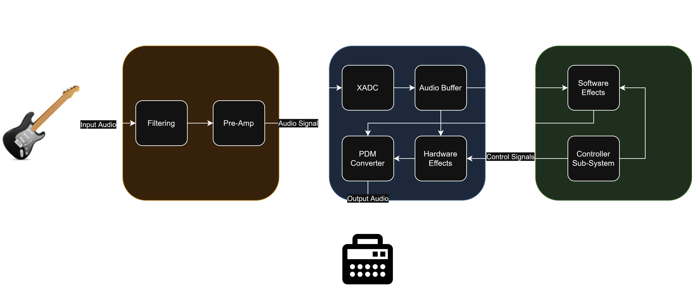

# SoC_Final_Project

Final project repository for EEL4930

## Team Members
1. Case Zumbrum (Undergraduate)

## Brainstorming

### Audio Processor
Essentially we would create a guitar pedal. Takes in single ended audio signal (probably across ADC since there is no dedicated audio I can find) and produces some output (delay, distortion, wah). I (case) did something similar but fully on FPGA before.

* OS: Handle which effect is currently playing, software to do simple transforms. Would need to store audio waveform in buffer.
* Hardware: FPGA FFT for mixing control, hardware acceleration for delay possibly, audio output control
* Circuitry: Possibly need to extend (or use cusom) adc

#### Implementation
##### Circuitry
* Simple filter for noise (may not be needed, but I expect the ADC to not be high quality)
* Simple pre-amp from ~1V -> 5V (may not be needed, I think the pot on the board might affect max voltage on ADC)

###### Hardware
* XADC system: Already on Urbana board, 12bit ~1MHz, supports AXI interface, produces sampled audio
* Audio buffer/FIFO: Use AXI/DMA possibly to read in data from XADC, stores a frame of sampled audio
* Hardware Effects: Consume audio input buffer and produce audio output buffer, do some effect
* PDB System: Consumes audio output buffer and converts it from sampled audio into a PDB signal (to be sent across audio jack)

###### Software
* Control system: setup DMA, control effects from CLI, monitor hardware
* Saving system: Consume audio output buffer to save output to mp3 file
* Software effects: Consume audio input buffer and produce audio output buffer, do some effect 